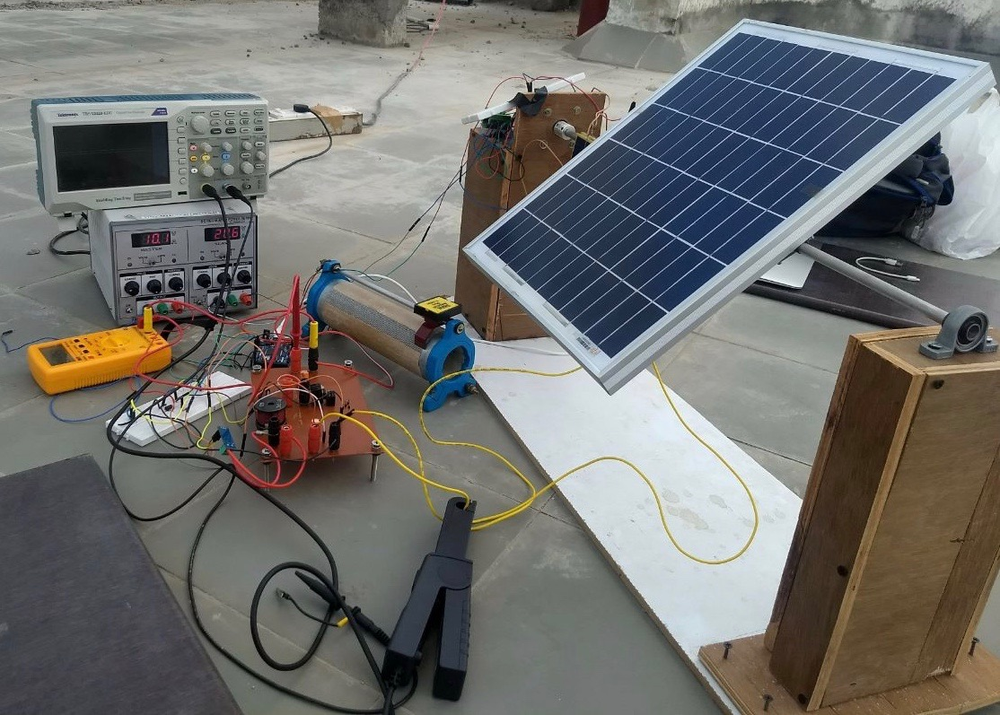

# Capstone-Project-Electrical-Engineering
My Capstone Project - Solar Panel with MPPT mounted on single axis tracker
Solar energy has been the focus of renewable energy research because it can be harnessed using PV
panels at any place that receives sunlight. The power supplied by the panel is subject to variations in
loads, irradiance and alignment. These irregularities result in decreased panel efficiency and
significant power loss. Hence, for low power applications, there is a need to implement new
techniques to improve the efficiency of the PV arrays.
This thesis augments the energy harnessing capability of the PV panel by integrating MPPT
algorithm, Perturbation and Observation, with Single-Axis Tracking mechanism. It presents a novel
single degree sun tracking mechanism using an ARM processor and provides results of its
performance in real time under various weather conditions. Additionally, hardware design and
simulation of DC/DC boost converter with MPPT control is done and experimental verification is
performed using imitated PV. Finally, these two independent systems are integrated and data is
captured for six different comparative models. The results of this research depicts that, for domestic
solar arrays, the combination of Single-Axis Tracking with MPPT provides a significant increase to
the power output than using just the MPPT algorithm.

